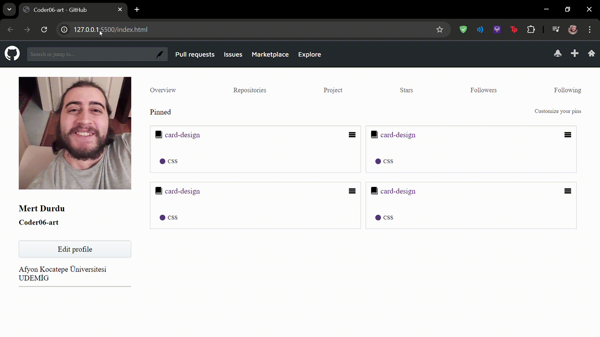

# **GitHub Klonu**

*Sass, HTML ve CSS kullanarak oluşturulmuş responsive bir GitHub klonu.*

## **Özellikler**

- **Duyarlı Tasarım**: Farklı ekran boyutlarına uyum sağlayan tamamen responsive bir tasarım.
- **Sass Entegrasyonu**: Etkili ve modüler CSS yönetimi için Sass kullanımı.
- **CSS Animasyonları**: Kullanıcı deneyimini artırmak için hafif animasyonlar eklendi.

## **Kurulum**

1. **Depoyu klonlayın**:
    ```bash
    git clone https://github.com/Coder06-art/github-klonu.git
    ```


## **Kullanılan Teknolojiler**

- HTML
- CSS
- Sass

## **GIF**

Proje hakkında kısa bir ön izleme için aşağıdaki GIF'i inceleyebilirsiniz:

- 
- [Kısayol](gif/gif.gif)

## **Katkıda Bulunma**

Katkıda bulunmak isterseniz, lütfen bir pull request gönderin.
